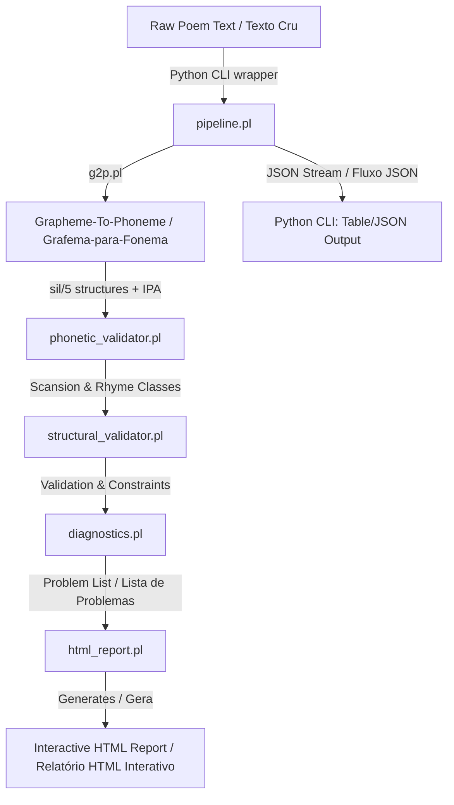

# PoemReason — Developer Guide / Guia do Desenvolvedor

Welcome to the developer guide for PoemReason. This document explains the core concepts, data structures, and architectural flow of the poetry validation engine.

Bem-vindo ao guia do desenvolvedor do PoemReason. Este documento explica os conceitos fundamentais, estruturas de dados e o fluxo arquitetural do motor de validação poética.

---

## 1. Architectural Philosophy / Filosofia Arquitetural

PoemReason is built on a hybrid architecture:
* **SWI-Prolog** handles the heavy lifting of linguistic rules, phonetic scansion, rhyme matching, and form constraints. Prolog's declarative paradigm is uniquely suited for this because poetry rules are naturally defined as constraints rather than step-by-step algorithms.
* **Python** handles CLI parsing, input serialization (YAML/JSON to Prolog facts), subprocess orchestration, and output formatting.

O PoemReason é construído sobre uma arquitetura híbrida:
* **SWI-Prolog** lida com a parte pesada das regras linguísticas, escansão fonética, correspondência de rimas e restrições de forma. O paradigma declarativo do Prolog é perfeito para isso, pois as regras de poesia são definidas naturalmente como restrições, e não como algoritmos passo a passo.
* **Python** lida com o CLI, serialização de entrada (YAML/JSON para fatos Prolog), orquestração de subprocessos e formatação de saída.

### Architecture Data Flow / Fluxo de Dados da Arquitetura

---

## 2. Core Domain Concepts / Conceitos de Domínio

### A. Grapheme-to-Phoneme (G2P)
* **English**: The G2P layer (`rules/g2p.pl`) converts orthographic words into phoneme streams, determines syllable stress, and builds an IPA (International Phonetic Alphabet) string.
* **Português**: A camada G2P (`rules/g2p.pl`) converte palavras ortográficas em cadeias de fonemas, determina a sílaba tônica e monta a representação IPA (Alfabeto Fonético Internacional).

### B. Enriched Syllable Representation / Representação Enriquecida (`sil/5`)
* **English**: The core data structures representing a syllable is the `sil/5` functor:
  `sil(Onset, Nucleus, Coda, Weight, Accent)`
  * `Onset`: Consonant cluster preceding the vowel (e.g. `[p, ɾ]` in *prato*).
  * `Nucleus`: Vowels and glides (e.g. `[a]` in *prato*).
  * `Coda`: Consonants following the nucleus (e.g. `[s]` in *passo*).
  * `Weight` (Duration): Mora count (`1` or `2` units), utilized by Japanese moraic traditions (Haiku/Tanka).
  * `Accent` (Stress): Stress marking (`tonica` or `atona`), utilized by Portuguese syllabic traditions.
* **Português**: A estrutura de dados central que representa uma sílaba é o functor `sil/5`:
  `sil(Onset, Nucleus, Coda, Weight, Accent)`
  * `Onset` (Ataque): Encontro consonantal que precede a vogal (ex: `[p, ɾ]` em *prato*).
  * `Nucleus` (Núcleo): Vogais e semivogais (ex: `[a]` em *prato*).
  * `Coda`: Consoantes que seguem o núcleo (ex: `[s]` em *passo*).
  * `Weight` (Peso/Duração): Contagem de moras (`1` ou `2` unidades), usada pelas tradições moraicas japonesas (Haiku/Tanka).
  * `Accent` (Acento/Tonicidade): Marcação de acento (`tonica` ou `atona`), usada pelas tradições silábicas lusófonas.

### C. Scansion / Escansão
* **English**: The process of determining the metric length of a line (`rules/phonetic_validator.pl`). It relies on two main linguistic rules:
  1. **Cut at Last Stressed Syllable (Corte na última tônica)**: Portuguese metric lines are only counted up to the last stressed syllable. Post-tonic syllables are ignored.
  2. **Synaloepha (Sinalefa)**: When a word ending in a vowel is followed by a word starting with a vowel, they can merge into a single syllable (e.g. *toda a* -> *to-da*). Since synaloepha is optional (poetic license), Prolog uses **backtracking** to generate all possible metric counts for a given line (e.g. `[6, 7]` syllables).
* **Português**: O processo de determinar a extensão métrica de um verso (`rules/phonetic_validator.pl`). Baseia-se em duas regras linguísticas principais:
  1. **Corte na última tônica**: Versos na tradição lusófona são contados apenas até a última sílaba tônica. Sílabas pós-tônicas são descartadas na contagem.
  2. **Sinalefa**: Quando uma palavra que termina em vogal é seguida por outra que começa com vogal, elas podem se fundir em uma única sílaba (ex: *toda a* -> *to-da*). Como a sinalefa é opcional (licença poética), o Prolog usa **backtracking** para gerar todas as contagens métricas possíveis para um verso (ex: `[6, 7]` sílabas).

### D. Rhyme Extraction / Extração de Rima
* **English**: The rhyme engine extracts the phonetic rhyme tail of a verse starting from the nucleus of the last stressed syllable to the end of the line:
  * **Consonant Rhyme (Rima Consoante)**: Vowels AND consonants are compared (e.g., *calma* `/ˈkawmɐ/` and *alma* `/ˈawmɐ/` rhyme).
  * **Assonant Rhyme (Rima Toante)**: Only the vowels are compared (e.g., *passo* and *lento* do not consonant-rhyme, but both share the vowel sequence `[a, o]`).
* **Português**: O motor de rimas extrai a cauda fonética do verso a partir do núcleo da última sílaba tônica até o final:
  * **Rima Consoante**: Vogais E consoantes são comparadas (ex: *calma* `/ˈkawmɐ/` e *alma* `/ˈawmɐ/`).
  * **Rima Toante (Assonante)**: Apenas as vogais são comparadas (ex: *casa* e *cama* possuem a mesma sequência de vogais `[a, a]`).

#### Selecting the rhyme mode per form / Selecionando o modo por forma
* Every verse is annotated by `pipeline.verso_ln/2` with **both** tails: `verso(Text, Sils, rima(ConsonantTail, AssonantTail))`. The validator picks the right slot based on the form's rhyme scheme:
  * Bare list (`[a,b,a,b]`) → consonant comparison (strict; sonnets, decima, trova).
  * `toante([a,b,a,b])` wrapper → assonant comparison (popular tradition; quadra, cordel sextilha).
* This lets the same poem be validated against a strict and a popular form without recomputing phonetics.
* Cada verso é anotado pelo `pipeline.verso_ln/2` com **as duas** caudas: `verso(Texto, Sils, rima(CaudaConsoante, CaudaToante))`. O validador escolhe o slot pelo esquema da forma — lista nua dispara comparação consoante; `toante([...])` dispara comparação toante. Isso permite revalidar o mesmo poema contra diferentes formas sem refazer a fonética.

---

## 3. Rule Module Directory / Guia dos Módulos de Regras

* **`g2p.pl`**
  * Rules for phonetizing letters, voicing consonants, nasalizing vowels, resolve code/onset, and assigning stress based on graphical accents or word endings.
  * Regras para fonetizar letras, vozeamento de consoantes, nasalização de vogais, resolução de coda/ataque e atribuição de tonicidade.
* **`phonetic_validator.pl`**
  * Handles the core metric scansion (syllables vs moras), handles synaloepha rules, and extracts rhyme tails.
  * Lida com a escansão métrica (sílabas vs moras), regras de sinalefa e extração de cauda de rimas.
* **`structural_validator.pl`**
  * The form dictionary (Haiku, Sonnet, Sestina, etc.). Validates structure, rhyme patterns, and custom constraints (like line permutations in Sestinas).
  * O dicionário de formas (Haiku, Soneto, Sextina, etc.). Valida a estrutura, esquemas de rimas e restrições específicas (como permutações de versos em Sextinas).
* **`diagnostics.pl`**
  * Evaluates a poem against a form. Crucially, **this engine never fails**; it collects errors using a majority vote consensus to detect which verse broke the rule.
  * Avalia um poema contra uma forma. Crucialmente, **este motor nunca falha**; ele coleta erros usando consenso de voto de maioria para apontar qual verso quebrou a regra.

---

## 4. Testing / Testes

* **English**: Tests use SWI-Prolog's built-in **plunit** library. They are placed in `tests/` and run automatically using:
  `./scripts/test_all.sh`
* **Português**: Os testes usam a biblioteca nativa do SWI-Prolog **plunit**. Eles residem em `tests/` e são executados automaticamente através de:
  `./scripts/test_all.sh`
